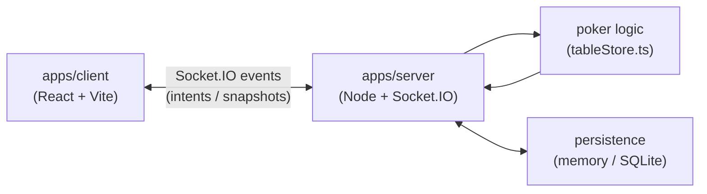

# Friendly Hold'em

Private-link, play-money Texas Hold 'em for friends.

## Architecture

Server-authoritative realtime app: the server owns all poker state and broadcasts player-specific snapshots. See [docs/architecture.md](docs/architecture.md) for detail.



## Workspace

- `apps/client` - React, Vite, and TypeScript browser app.
- `apps/server` - Node.js and TypeScript server skeleton.
- `packages/shared` - shared TypeScript types for client and server.

## Commands

```bash
pnpm install
pnpm dev
pnpm typecheck
pnpm build
pnpm start
pnpm test
pnpm test:e2e
pnpm test:e2e:prod
```

Copy `.env.example` to `.env` (loaded by the server dev script) or export matching environment variables before running the server with non-default settings.

Bash with NVM:

```bash
export NVM_DIR="$HOME/.nvm"
[ -s "$NVM_DIR/nvm.sh" ] && . "$NVM_DIR/nvm.sh"

nvm use 24.14.0
corepack enable
pnpm install
pnpm dev
```

## Testing

See [docs/testing.md](docs/testing.md) for the full testing strategy, test layers, how to run each suite, and why some E2E tests are intentionally skipped.

pnpm dev runs both packages in parallel:

```
client Vite app at http://localhost:5173
server at http://localhost:8787
```

In Codex/PowerShell, use:

```
$nodeBin = Join-Path $env:USERPROFILE '.nvm\versions\node\v24.14.0\bin'
$env:PATH = "$nodeBin;$env:PATH"
pnpm.cmd dev
```

## Deployment

See [docs/deployment.md](docs/deployment.md) for the production-like single Node service path, required environment values, and the static-hosting alternative.
