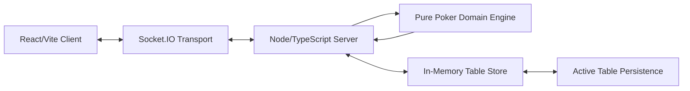

# High-Level Architecture

## Overview

Friendly Hold'em is a server-authoritative realtime web app. The client renders player-specific table snapshots and sends player intents. The server owns all poker state, validates every command, deals cards, manages betting, settles pots, and broadcasts updated snapshots through Socket.IO.

## Runtime Shape



## Monorepo Structure

```text
apps/
  client/
  server/
packages/
  shared/
```

- `apps/client` contains the React, Vite, and TypeScript frontend.
- `apps/server` contains the Node.js, TypeScript, HTTP, Socket.IO, config, logging, and table-session runtime.
- `packages/shared` contains shared TypeScript types used by client and server.

## Client Responsibilities

- Render the current player-specific table snapshot.
- Collect player intents such as fold, check, call, raise, all-in, chat, sit out, and rejoin.
- Store the browser session token for reconnecting to the same seat.
- Provide mobile-friendly turn-focused UI.
- Provide beginner and host help screens.
- Provide basic PWA installability and app-shell/static asset caching.
- Never infer hidden game state or decide poker outcomes.

## Server Responsibilities

- Create and manage private in-memory tables.
- Generate high-entropy table IDs and session tokens.
- Own all authoritative game state.
- Translate Socket.IO events into domain commands.
- Validate all commands before applying them.
- Produce player-specific table snapshots.
- Send only allowed hidden information to each viewer.
- Maintain bounded in-memory table event logs.
- Handle reconnects, disconnects, sitting out, host controls, and chat.
- Emit lightweight structured logs.

## Domain Engine Responsibilities

The poker engine is a pure TypeScript module with a command-in, result-out API:

```ts
applyCommand(tableState, command): CommandResult
```

It owns:

- Table and hand state transitions.
- Deck creation, shuffle, and dealing.
- Dealer button and blind rotation.
- Legal action calculation.
- Betting round progression.
- Fold, check, call, raise, and all-in behavior.
- Main pot and side-pot creation.
- Showdown reveal eligibility.
- Hand evaluation through a wrapped evaluator library.
- Pot settlement and stack updates.
- Domain events and command rejection reasons.

It should be testable without Socket.IO, React, or a running server.

## Realtime Sync

- Socket.IO is the realtime transport.
- One Socket.IO room maps to one private table.
- Clients send intent events.
- The server applies domain commands and broadcasts full table snapshots after successful state changes.
- Snapshots are player-specific and must not expose hidden cards to other players or spectators.
- Invalid commands return safe rejection messages.

## State And Persistence

- MVP state is in memory only.
- Server restart ends active tables.
- Invite links are valid only while the in-memory table exists.
- A bounded in-memory event log is kept per table for action history and debugging.
- Database persistence is a post-MVP backlog item.

Post-MVP active table persistence should preserve the latest authoritative table state across server restarts, including an in-progress hand. It should restore the current hand state, deck order, board, hole cards, committed bets, current actor, action log, stacks, settlement state, host identity, participants, and session tokens.

The first persistence implementation should support SQLite and store one versioned serialized active-table state per table, plus metadata such as table ID, schema version, last activity time, and update time. The table-session runtime should depend on a narrow persistence port rather than SQLite directly so another backend can be added later without changing the domain model.

Every successful table-changing command should save the updated table state synchronously before the server acknowledges the command or broadcasts new snapshots. Passive page views and rejected commands should not extend table lifetime. Persisted active tables should expire after a configurable inactivity window based on the last successful table-changing command.

Live socket connections remain ephemeral. During startup restore, all participants should be marked disconnected, and browsers reconnect with their existing session tokens. If a restored current actor is disconnected and already past the configured disconnected-action grace period, the server should apply the normal auto-check or auto-fold behavior after startup restore finishes.

If a persisted active table cannot be restored because its state is corrupted or uses an unsupported schema version, the server should quarantine that record, log a redacted startup error, keep running, and make the affected table unavailable rather than risk invalid poker state.

## Deployment

- MVP targets a single always-on Node web service that supports WebSockets.
- The Node service may serve the built React app or be paired with static hosting.
- The app should not depend on serverless-only hosting.
- MVP is complete when deployed and playable by friends over the internet from separate devices.

## Testing Strategy

The domain engine is the testing foundation: it is a pure module (see Domain Engine Responsibilities) that must be testable without Socket.IO, React, or a running server, and its tests are written before UI polish. Vitest covers domain and unit logic; Playwright covers the end-to-end user path across desktop and mobile browsers.

See [testing.md](testing.md) for the full strategy, test layers, coverage expectations, and how to run each suite.

## Security And Privacy Boundaries

- The server must never send hidden hole cards to unauthorized clients.
- All socket commands are validated server-side.
- Chat and repeated invalid commands should be rate-limited.
- Display names and chat messages are sanitized or escaped before rendering.
- Table IDs and session tokens use secure randomness.
- Logs must not include private hole cards or session tokens.
- Production CORS is restricted to configured origins.
- Persisted active table state contains sensitive operational data, including session tokens and unrevealed cards. The application should not log persisted table state, and the deployment environment should protect the SQLite file or database storage.

## Intentional MVP Constraints

- No accounts or database.
- No real-money wagering.
- No public lobby or matchmaking.
- No offline gameplay.
- No casino-grade audit trail.
- No serverless-only deployment assumption.
