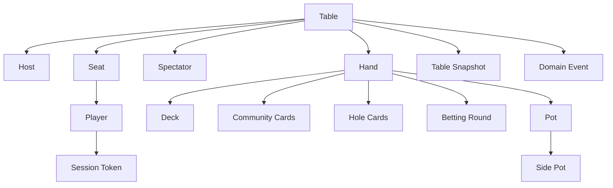
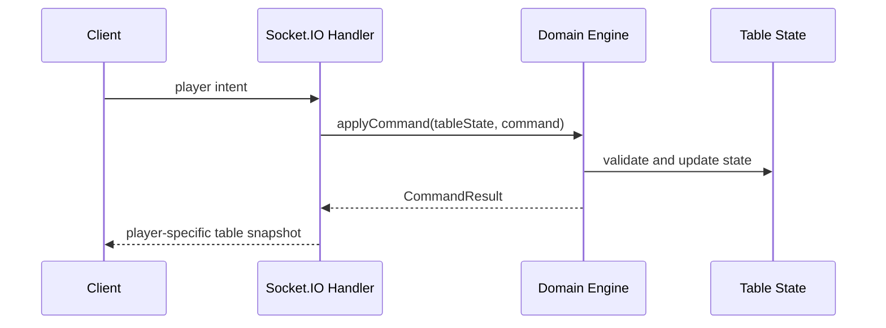

# Domain Model

This document defines the shared vocabulary for the online multiplayer Texas Hold 'em game. It is a conceptual model for planning and implementation, not a database schema.

## Core Entities

### Table

A private game room created by a host. A table has an invite ID, seats, spectators, configuration, current hand if one is active, and recent public domain events.

### Host

The player who created the table. The host has limited control actions such as starting hands, dealing the next hand, approving rebuys, seating spectators between hands, and handling inactive players.

### Seat

A position at the table that can be occupied by a player. Seats are auto-assigned. Seat order determines dealer button, blinds, and action order.

### Player

A participant who can occupy a seat, receive hole cards, post blinds, and take poker actions. A player has a display name, stack, session token, connection status, and sit-out status.

### Spectator

A participant who can view public table state and chat but cannot take poker actions or see hidden cards.

### Session Token

A private browser-held token used to reconnect a player to the same seat during the active in-memory table session.

### Hand

One deal of Texas Hold 'em within a persistent table. A hand tracks dealer button, blinds, deck, community cards, player hole cards, betting round, current actor, committed bets, pots, and settlement state.

### Deck

A shuffled collection of 52 unique cards owned by the server for a hand.

### Card

A rank and suit pair, such as ace of spades or ten of hearts. The server owns all card state and only exposes hidden cards to the player allowed to see them.

### Betting Round

One of preflop, flop, turn, or river. Each round tracks current bet, player commitments, action order, and whether betting is complete.

### Player Action

An intent sent by a client and validated by the server. MVP actions include fold, check, call, raise, and all-in.

### Pot

Chips contested by one or more eligible players. The main pot contains chips every active or all-in player can contest according to their committed amount.

### Side Pot

A pot created when players have committed different total amounts, usually because one or more players are all-in. Only eligible players can win each side pot.

### Table Snapshot

A server-produced view of table state sent to clients. Snapshots are player-specific so hidden information is only included for the correct player.

Conceptually, a table snapshot should include:

- Table ID and host ID.
- Viewer role and permissions.
- Seats and seated player summaries.
- Spectator summaries or spectator count.
- Current hand phase.
- Public board cards.
- Viewer hole cards if the viewer is seated in the active hand.
- Pot summary, including side pots when relevant.
- Current bet and call amount.
- Active player.
- Legal actions available to the viewer.
- Public action log.
- Chat preview or recent messages.
- Player connection, sit-out, and busted statuses.
- Host controls available to the viewer when the viewer is host.

### Domain Event

A factual record produced by the domain engine after a command is applied, such as player called, flop dealt, player folded, or pot awarded. Public domain events can appear in the action log.

### Command Result

The result of applying a command to table state. It includes the updated table state, domain events, and a rejection reason if the command is invalid.

## Relationship Overview

## Command Flow

## Initial Domain Commands

These commands describe the first implementation vocabulary. Exact TypeScript shapes can be refined during implementation.

### CreateTable

Creates a new private table, assigns the creator as host, and returns the invite link information.

### JoinTable

Adds a participant to an existing private table by invite ID. Before the first hand, the participant may be auto-seated if seats are available. After the first hand starts, the participant joins as a spectator unless the host seats them between hands.

### ReconnectPlayer

Restores a participant to an existing player or spectator identity using a browser-held session token.

### SitOut

Marks a seated player as sitting out between hands.

### Rejoin

Returns a sitting-out player to active seated status between hands.

### StartHand

Starts the first hand at a table. Only the host can issue this command.

### DealNextHand

Starts the next hand after the previous hand has settled. Only the host can issue this command.

### PlayerAction

Applies a poker action for the current actor. Supported actions are fold, check, call, raise, and all-in.

### ApproveRebuy

Allows the host to restore a busted or sitting-out player to the configured starting stack between hands.

### SeatSpectator

Allows the host to move a spectator into an open auto-assigned seat between hands.

### RemovePlayer

Allows the host to remove an inactive player between hands.

### HostAutoFoldInactivePlayer

Allows the host to auto-fold the current actor when that player has not acted for at least 2 minutes. An all-in player cannot be folded this way.

### SendChatMessage

Adds a bounded table-scoped chat message after validating participant identity, length, and rate limits.

## Notes

- The table is the top-level runtime aggregate for MVP.
- The hand is nested inside the table and exists only while a hand is active or recently settled.
- The server is authoritative for every entity in this model.
- The client never owns game state; it renders snapshots and sends intents.
- This model should evolve when the implementation reveals clearer names or boundaries.
